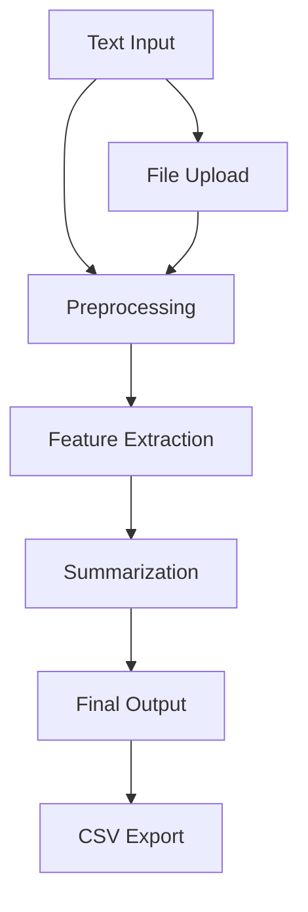

# 📚 Extractive Text Summarizer

> **Supervisor**: Dr. Samyan Qayyum Wahla  
> **Group Members**: Faisal Ilyas (2022-CS-03), Khalil Ahmad (2022-CS-93)

---

## 🚀 Project Overview
Extractive Text Summarizer identifies and selects key sentences from a text to capture its core meaning while reducing its length without losing essential information. It helps:

- 🕒 Save time
- 📈 Increase productivity
- 🧠 Enhance decision-making abilities

---

## 🔍 Did You Know?

- 📖 In **2022**, the average daily time spent reading was **15 minutes**.
- 📘 By **2022**, **30%** reported having read an e-book.
- 📶 In **2023**, Americans used over **100 trillion megabytes** of wireless data.

(📊 *Source: Pew Research Center*)

---

## 🌟 Features

- **Streamlit**: For an interactive UI.
- **Python**: Backend implementation.

---

## 🌐 Technologies Used

- **Streamlit** for a user-friendly and interactive interface.
- **Python** for data processing and feature extraction.

---

## 🌏 Alignment with UN SDGs

This project aligns with the following **Sustainable Development Goals**:

1. 🏫 Quality Education (SDG 4)
2. 🌐 Industry, Innovation, and Infrastructure (SDG 9)
3. 🔄 Reduced Inequalities (SDG 10)
4. 🌍 Responsible Consumption and Production (SDG 12)

---

## 📚 Methodology

1. **Input Text**: Users provide text through file upload or direct input.
2. **Preprocessing**:
   - Tokenization
   - Cleaning
3. **Feature Extraction**:
   - Using **TF-IDF** and **LSA**
4. **Summarization**:
   - Extracting key sentences
   - Generating final summaries
5. **Output**: Summarized content is displayed or exported as a CSV file.



---

## 📊 Results

- **BLEU**: 0.34 (Measures overlapping n-grams)
- **ROUGE-1**: 0.60 (High overlap of unigrams)
- **ROUGE-2**: 0.04 (Overlap of bigrams)
- **ROUGE-L**: 0.31 (Overlap at sentence level)

---

## 🔮 Future Work

- Implementing **abstractive summarization**
- Adding more flexible **UI**
- Introducing new functionalities for students
- Incorporating **QnA features**

---

## 🛠 How to Run

### Step 1️⃣: Clone the Repository
```bash
git clone https://github.com/your-repo-name.git
```

### Step 2️⃣: Install Dependencies
```bash
pip install -r requirements.txt
```

### Step 3️⃣: Run the Application
```bash
streamlit run app.py
```

---

## 🎯 Usage

1. Upload your text file or paste text into the input box.
2. Click **Summarize** to generate a concise summary.
3. View or export the results in CSV format.

---

## 🧠 Conceptual Overview
Extractive summarization identifies and selects key sentences from a text to retain its core meaning while reducing its length. This saves time, increases productivity, and improves decision-making abilities.

---

## 🖼 Poster


---

## 🤝 Contributors

- **Faisal Ilyas** (2022-CS-03)  
- **Khalil Ahmad** (2022-CS-93)  

---

## 📜 License

This project is licensed under the MIT License. See the [LICENSE](LICENSE) file for details.
